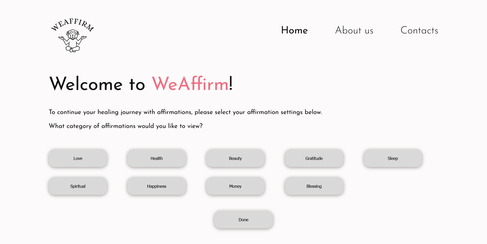
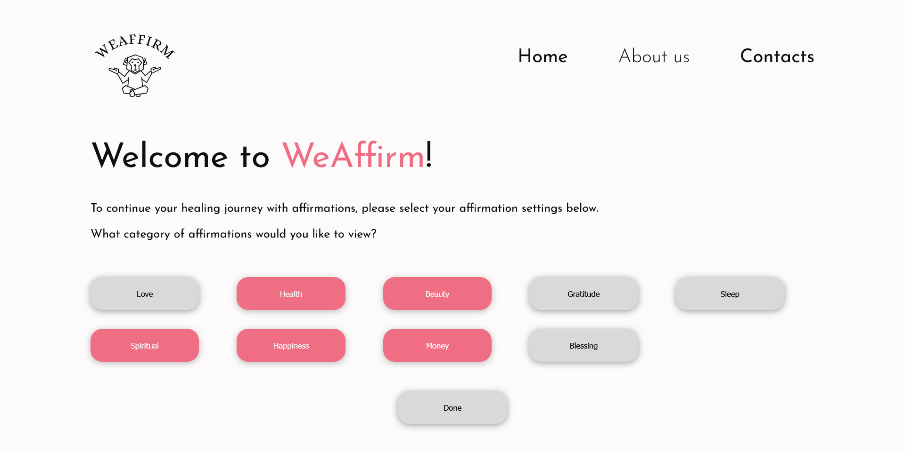
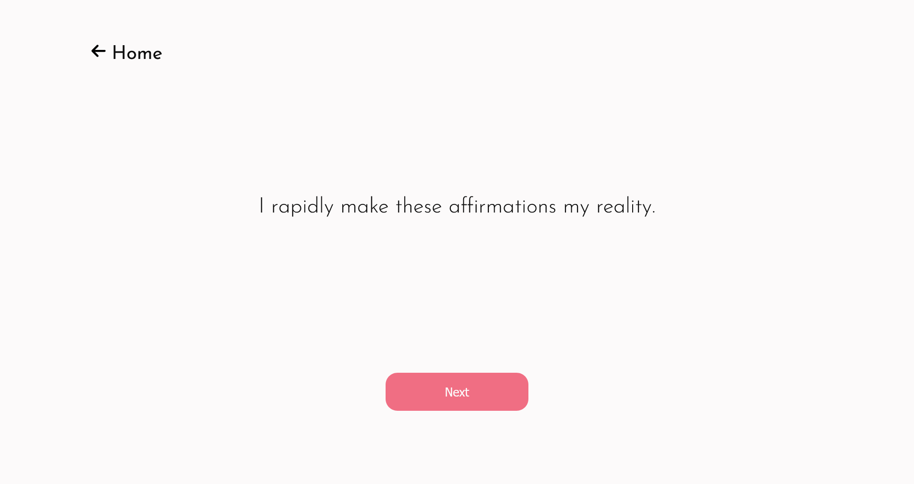
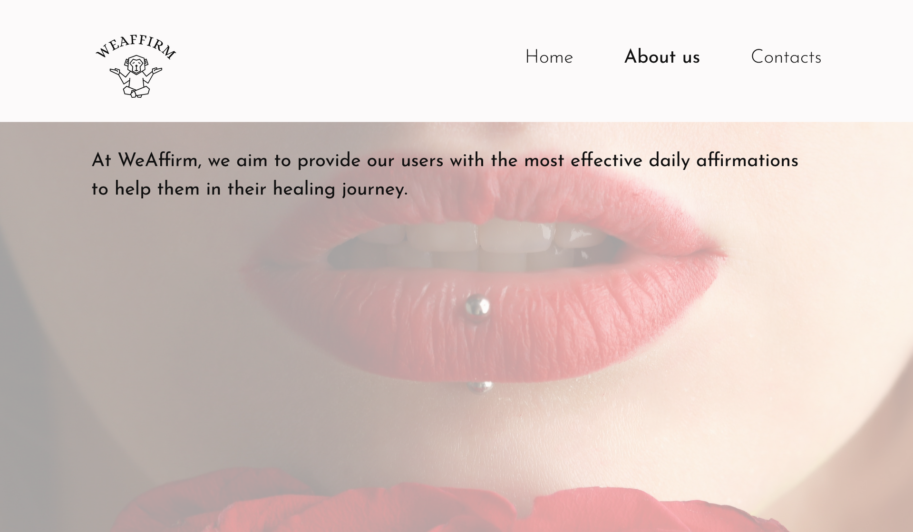

# WeAffirm
This website is a self-practicing platform to help users in their healing journey by providing them with customized affirmations, anywhere and anytime.

## Table of contents

- [The Screenshots](#the-screenshots)
- [Links](#links)
- [Features](#features)
- [Built with](#built-with)
- [Resources](#resources)

## The Screenshots

## Links
- [Demo 💥](https://ganbnuray.github.io/WeAffirm/)
- [Youtube Video]()
- [Figma Design Pages]()
- [Presentation]()

## Features

- Easy to navigate User Interface
- Wide range of user preferences
- Diverse group of outputs possible
- Contacts to receive feedback from users
- Info page to inform users about the purpose of the website

## Built with

- Semantic HTML5 markup
- CSS custom properties
- Flexbox
- CSS Grid
- JavaScript

## Resources
- [Dataset from Kaggle](https://www.kaggle.com/datasets/pratiksharm/positive-affirmations-with-tags)
- [CSV to JSON converter](https://csvjson.com/csv2json)
- [Figma for Design](https://www.figma.com/)
- [Font Awesome](https://fontawesome.com/)
- [Color Palette Generator](https://coolors.co/)
- [Canva](https://www.canva.com/)
- [Pexels](https://www.pexels.com/)

